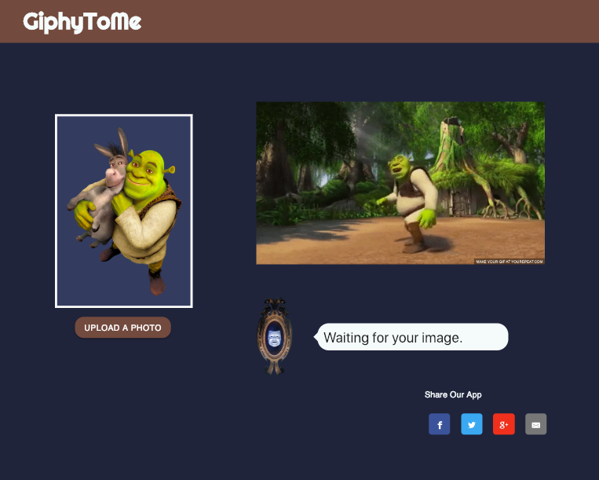

# GiphyToMe

GiphyToMe is a facial recognition application where you may upload a photo in order to generate gifs and text associated with the physical attributes recognized through your upload.  

## Getting Started

To start this process, visit https://giphy-to-me.herokuapp.com/index.html and upload a photo. As soon as you have selected your photo, a gif and randomly generated texts will populate the screen. You may also share your results by clicking the "Share" button underneath the populated text. 

### Prerequisites

This application requires no installation, though you should have a photo (or photos) saved locally in order to generate a gif and text. 

## Running the tests

You may upload a photo or many. The physical attributes recognized in your photo will generate different gifs and text associated with the attribute ratings recognized in the photo. 

### Break down into end to end tests

You may want to upload another photo to retrieve a new gif and set of correlating text. Face++ has many features and can assess for many physical attributes, but we are pulling only age, beauty, and gender to generate text.

### Notable code snippets

The code snippet we showed the class is in our main.js file, from lines 470 to 514. This snippet displays the text letter by letter, and chat bubble by bubble. 

### Notable blocks to functionality

Firstly, we had trouble displaying the text letter by letter because we had to accertain that the first line would finish before the second bubble would append to the screen. 

Secondly, our upload image button was difficult to style. We basically could not, so we created an inviable input div for the image under the upload button. This guaranteed both functionality and asthetics. 

## Deployment

This site is accessible by https://giphy-to-me.herokuapp.com/index.html. Our GitHub repository is https://github.com/cvanglee/House-Martell.

## Built With

* [Materialize](https://cdnjs.cloudflare.com/ajax/libs/materialize/1.0.0/css/materialize.min.css) - The styling framework used
* [Google Fonts](https://fonts.googleapis.com/css?family=Oxygen|Righteous|Roboto) - Font Styling
* [Giphy](https://media.giphy.com/media/GqtNlBsWoEXDy/giphy.gif) - API used to generate random gifs
* [Face++](https://api-us.faceplusplus.com/) - API used to analyze photos
* [Share Button](https://sharingbuttons.io/) - Share buttons used
* [Chat Bubble](https://leaverou.github.io/bubbly/) - Chat bubbles used

## Authors

* **Yuwen Li** - (https://github.com/muzlee1113)
* **Dylan Whipple** - (https://github.com/ProLeon)
* **Chong Lee** - (https://github.com/cvanglee)
* **Dave Farnick** - (https://github.com/dfarnick)
* **Hannah Schuelke** - (https://github.com/HannahSchuelke)